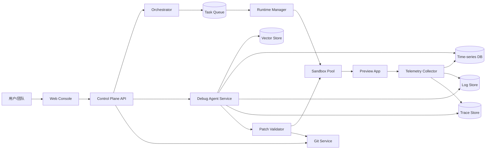
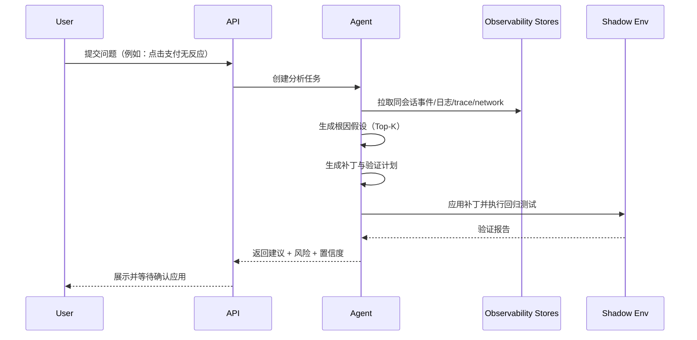

# AI 应用预览与调试平台技术蓝图（可执行版）

## 1. 目标与范围

### 1.1 产品目标
构建一个以 **AI 生成应用的预览与调试** 为核心的平台：
- 面向结果而非代码编辑。
- 支持从 Prompt 到可运行预览的分钟级闭环。
- 支持运行态可观测、自动定位问题、补丁验证与回滚。

### 1.2 非目标（MVP 阶段）
- 不做完整 IDE 替代。
- 不做复杂 CI/CD 编排平台。
- 不支持任意语言生态，首期聚焦 Node.js/TypeScript Web 应用。

---

## 2. 系统架构总览



### 2.1 两大平面
- **控制平面（Control Plane）**：鉴权、项目管理、任务编排、Agent 调用、权限与审计。
- **数据平面（Data Plane）**：预览应用运行、日志/指标/Trace 收集、会话回放。

### 2.2 关键设计原则
- 预览环境强隔离（容器/微 VM）。
- 所有运行态信号事件化（Event-first）。
- AI 调试必须基于真实运行证据（trace + logs + network + replay）。
- 所有补丁必须经过“影子验证”才能应用。

---

## 3. 核心服务拆分

## 3.1 `console-web`
**职责**：项目创建、预览、日志、会话回放、调试建议、补丁确认。

**建议技术栈**：
- Next.js + TypeScript
- Tailwind + shadcn/ui
- TanStack Query

## 3.2 `control-api`
**职责**：统一 API Gateway（REST + WebSocket），鉴权、配额、路由。

**建议技术栈**：
- Fastify/NestJS
- JWT + RBAC
- OpenAPI 3.1

## 3.3 `orchestrator`
**职责**：接收任务（生成、启动预览、回放、调试、补丁验证），编排到队列。

**建议技术栈**：
- Temporal（优先）或 BullMQ

## 3.4 `runtime-manager`
**职责**：管理预览沙箱生命周期：创建、启动、暂停、销毁、快照、回滚。

**建议技术栈**：
- Kubernetes + containerd
- 镜像缓存（registry mirror）

## 3.5 `telemetry-collector`
**职责**：采集 FE/BE logs、metrics、trace、network 事件。

**建议技术栈**：
- OpenTelemetry Collector
- ClickHouse（日志/事件）
- Prometheus（指标）
- Tempo/Jaeger（trace）

## 3.6 `debug-agent`
**职责**：根因分析、补丁建议、验证计划生成。

**建议技术栈**：
- 多 Agent 编排（Planner / Investigator / Fixer / Verifier）
- 向量检索（pgvector/Weaviate）

## 3.7 `patch-validator`
**职责**：在影子环境应用补丁并执行场景测试，给出通过/失败结论。

**建议技术栈**：
- Playwright（E2E）
- Vitest/Jest（单测）
- Lighthouse CI（性能）

---

## 4. 数据模型（首版）

## 4.1 关系型数据库（PostgreSQL）

### `projects`
- `id` (uuid)
- `name` (text)
- `owner_id` (uuid)
- `created_at` (timestamptz)

### `environments`
- `id` (uuid)
- `project_id` (uuid)
- `type` (enum: `preview`, `shadow`, `prod`)
- `status` (enum: `creating`, `running`, `sleeping`, `failed`, `terminated`)
- `runtime_ref` (text)

### `preview_sessions`
- `id` (uuid)
- `project_id` (uuid)
- `environment_id` (uuid)
- `started_at` / `ended_at`
- `entry_url` (text)

### `agent_runs`
- `id` (uuid)
- `project_id` (uuid)
- `session_id` (uuid, nullable)
- `trigger` (enum: `manual`, `auto_error`, `test_failure`)
- `status` (enum: `queued`, `running`, `completed`, `failed`)
- `result_summary` (jsonb)

### `patches`
- `id` (uuid)
- `project_id` (uuid)
- `agent_run_id` (uuid)
- `diff` (text)
- `status` (enum: `proposed`, `validated`, `applied`, `rejected`)
- `validation_report` (jsonb)

## 4.2 事件模型（ClickHouse）
统一事件表 `runtime_events`：
- `event_id` (uuid)
- `project_id` (uuid)
- `environment_id` (uuid)
- `session_id` (uuid)
- `timestamp` (datetime64)
- `event_type` (`ui_click`, `console_error`, `network_request`, `network_response`, `backend_log`, `trace_span`, `agent_step`)
- `severity` (`debug`, `info`, `warn`, `error`)
- `payload` (json)
- `trace_id` / `span_id`

---

## 5. API 设计（MVP）

## 5.1 项目与预览
- `POST /v1/projects`
- `POST /v1/projects/{id}/generate`
- `POST /v1/projects/{id}/environments/preview:start`
- `POST /v1/environments/{id}:sleep`
- `POST /v1/environments/{id}:resume`

## 5.2 可观测与回放
- `GET /v1/projects/{id}/sessions/{sessionId}/events`
- `GET /v1/projects/{id}/sessions/{sessionId}/timeline`
- `GET /v1/projects/{id}/errors?since=...`

## 5.3 AI 调试
- `POST /v1/projects/{id}/debug:analyze`
- `GET /v1/agent-runs/{runId}`
- `POST /v1/patches/{patchId}:validate`
- `POST /v1/patches/{patchId}:apply`
- `POST /v1/patches/{patchId}:rollback`

## 5.4 WebSocket
- `/ws/projects/{id}/events`：实时日志与错误推送
- `/ws/agent-runs/{id}`：Agent 执行进度流

---

## 6. 调试 Agent 工作流（可执行）



### 输出契约（JSON）
```json
{
  "runId": "uuid",
  "rootCauseHypotheses": [
    {"title": "前端按钮事件未绑定", "confidence": 0.78}
  ],
  "proposedPatch": {"diff": "..."},
  "verificationPlan": ["playwright: checkout.spec.ts"],
  "risk": {"level": "medium", "notes": ["可能影响移动端支付流程"]}
}
```

---

## 7. 安全、隔离与合规

## 7.1 运行隔离
- 每个预览环境独立命名空间 + 网络策略。
- 默认无公网出站，按域名白名单放行。
- 文件系统只读基镜像 + 可写层配额。

## 7.2 秘密管理
- 环境变量使用 Secret Manager（非明文落库）。
- 控制台仅展示掩码值。

## 7.3 隐私与审计
- 会话回放默认脱敏（邮箱、手机号、token）。
- 所有 patch 应用与回滚均落审计日志。

---

## 8. 可靠性与成本控制

## 8.1 SLO 建议
- 预览环境启动 P95 < 45s
- 日志延迟 P95 < 3s
- 调试分析首个结果 P95 < 20s

## 8.2 成本策略
- 空闲 15 分钟自动休眠，24 小时未访问自动归档。
- 热门框架基础镜像预热。
- 采样策略：高频 debug 事件 10% 抽样，error 事件全量。

---

## 9. 里程碑计划（12 周）

## Phase 1（第 1-4 周）：可运行预览
- 项目创建、Prompt 生成、预览启动
- 控制台查看基础日志与错误
- 快照与手动回滚

## Phase 2（第 5-8 周）：可观测 + 初级调试
- 统一事件模型 + trace 关联
- 会话时间线与网络面板
- Agent 根因候选与补丁建议（人工确认）

## Phase 3（第 9-12 周）：补丁验证闭环
- 影子环境自动验证
- 场景测试回放
- 一键应用 patch + 审计追踪

---

## 10. 首版任务拆解（可直接进 Jira）

1. `INFRA-01`：K8s 命名空间隔离与配额模板
2. `RUNTIME-01`：预览环境创建/暂停/恢复 API
3. `GEN-01`：Prompt 生成任务编排（Temporal workflow）
4. `OBS-01`：OTel Collector 部署与日志落 ClickHouse
5. `OBS-02`：前端 SDK 上报 console/network/error
6. `DEBUG-01`：调试 Agent 输入上下文拼装
7. `DEBUG-02`：根因假设输出协议 + UI 渲染
8. `PATCH-01`：影子环境应用 diff 与回归测试
9. `PATCH-02`：补丁通过后应用/回滚 API
10. `SEC-01`：PII 脱敏与审计日志
11. `BIZ-01`：配额与计费埋点（运行时分钟 + Agent token）

---

## 11. 验收标准（DoD）

- 用户可在 3 分钟内从 0 创建并打开可交互预览。
- 至少 1 个错误场景可由 Agent 给出根因候选 + 可执行补丁。
- 补丁必须在影子环境通过测试后才能应用。
- 所有关键操作可追溯（谁在何时对哪个项目做了什么）。

---

## 12. 推荐仓库结构

```txt
.
├─ apps/
│  ├─ console-web/
│  ├─ control-api/
│  ├─ orchestrator/
│  ├─ runtime-manager/
│  ├─ debug-agent/
│  └─ patch-validator/
├─ packages/
│  ├─ sdk-telemetry/
│  ├─ shared-types/
│  └─ eslint-config/
├─ infra/
│  ├─ k8s/
│  ├─ terraform/
│  └─ observability/
└─ docs/
   └─ ai-preview-debug-platform-blueprint.md
```

---

## 13. 下一步建议
1. 先落地 Phase 1 所需最小链路（生成→启动预览→日志可见）。
2. 同步定义统一事件模型，避免后期重构成本。
3. Agent 能力先“建议不自动修复”，逐步引入自动化。

